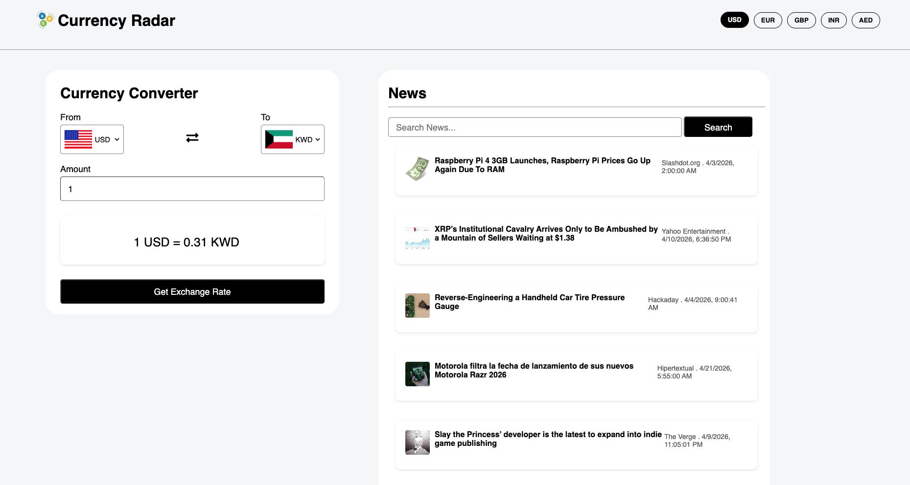

# Currency Radar

A currency converter with live exchange rates and realtime news. That let's you select any currency you wish to convert and also lets you swap them and get the coversion with currency specific news based on the selected currencies.

## Features

- Live currency coversion
- Swap currencies instantly to get exchange rate
- News feed that updates based on the currencies you select
- Also search news using Keywords

## Tech Stack

- HTML, CSS, JavaScript
- ExchangeRate API - for live exchange rates
- News API - for news feed

## Getting Started

**1. Clone the repo**

```

git clone https://github.com/Samufds/Currency-Radar.git

```

**2. Open 'Index.html' in your browser**

**Note:** API keys are currently exposed in the frontend. A backend proxy will be added in a upcoming update to secure them.

## Screenshots




## Future Imporvements

- To add a backend to secure API keys
- Historical exchange rate chart
- Used login and saved currency pairs with a conversion history
- Rate alert notification at a set target rate
